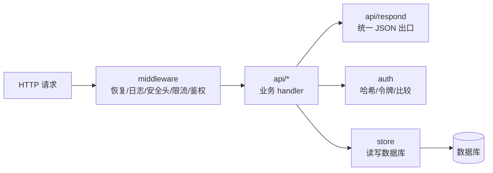

# 代码库导览

知道每个目录在干什么,改动时就知道该去哪、会影响谁。

## 顶层结构

```
cmd/
  node/         节点入口:business(DB + 全部 API + 调度器)/ edge(仅资源);均挂管控 WS + 根目录只读状态页(status.go)
  panel/        面板入口:节点注册表 + WS 管控连接器 + 管理 API + 托管游戏前端(webui.go)
  admintool/    运维 CLI:create-admin / reset-admin / 节点目录签名 / ca 离线证书签发
internal/
  api/
    client/     /client/* 握手与心跳(现役 2 个端点)  ← 协议保真重地
    resource/   边缘资产分发面:Bearer 鉴权 + S3 清单 + Range
    account/    /auth/login 管理员登录(玩家账号已移交 API 服务端)
    admin/      /admin/* 全部管理后台接口
    captcha/    /api/* PoW 验证码
    setup/      /setup/* 首次安装向导
    respond/    统一 JSON 响应与 4xx 错误
  control/      面板↔节点 WebSocket 管控协议(server/client/协议/节点密钥)
  directory/    签名节点目录(Ed25519 信任根,客户端多节点发现)
  panelstore/   面板本地 SQLite(节点注册表 + 面板管理员)
  store/        游戏存储层:方言抽象 + 全部 SQL + 内嵌迁移  ← 多方言重地
  auth/         口令哈希(scrypt)、token、等时比较、签名白名单
  middleware/   panic 恢复、日志、安全头、鉴权、限流、trust proxy、CORS(面板跨域直连节点)
  capworker/    PoW 验证码核心(挑战/兑换)
  autoban/      自动封禁:多路滥用信号(篡改/心跳伪造/资源高频/验证码连败/多账号)→ 写 bans;阈值存 config 表,后台可调
  scheduler/    定时任务:封禁过期 / 会话 GC / 心跳超时
  clienttoken/  自包含的 Ed25519 签名会话令牌(签发/校验,校验方不必与签发方共库)
  resourceauth/ 资产令牌(asset_auth)的签发与校验;与 API 服务端有一份相同拷贝
  pki/          节点身份证书链:签发、链校验、双向鉴权、自动续期、紧急吊销
  config/       CNV_* 环境变量加载与校验
web/            前端:React + 浏览器内 Babel,无构建步骤;由**面板**统一托管(节点不再托管 WebUI)
docs/           本文档站(VitePress)
deploy/         一键 root 部署:install.sh + systemd unit + edge.env.example
.github/workflows/build.yml   CI:测试 + 交叉编译 + 发布
```

`deploy/install.sh` 支持两种执行方式:本地 `sudo ./deploy/install.sh panel|node-business|node-edge`、或仿 MCSManager 的远程一行(`sudo su -c "wget -qO- .../install.sh | bash"`)。两条路径同一脚本:无角色参数时进交互菜单(读 `/dev/tty`,管道里也能正常拿用户输入);本地有 `deploy/systemd/*.service` 与 `deploy/edge.env.example` 就用本地版,远程拉时回落到脚本里内嵌的同源 heredoc;二进制按 `--bin > 本地 ./ > ./bin/ > /usr/local/bin/ > GitHub Release latest 下载` 顺序定位。脚本把二进制装到 `/opt/magireco/<角色>/bin/`、unit 复制到 `/etc/systemd/system/`、配置写 `/etc/magireco/<角色>.env`(`0640 root:magireco` 原子写)。**面板**因为托管全部人类前端,还会把 `web/` 铺到 `/opt/magireco/panel/web`(本地仓库优先,否则下载 Release 的 `web-static.tar.gz` 解压)并写 `CNV_WEB_DIR`;**业务节点** `.env` 含 `CNV_PANEL_PUBLIC_URL`(供客户端入口页 302 跳面板 + 放行前端跨域直连)。面板与业务节点的业务配置由各自的安装向导(`cmd/panel/install.go` / `internal/api/setup`)管,**脚本不参与**;边缘节点没有向导,配置全部由 `.env` 管(模板 `deploy/edge.env.example`,`.env` 后缀的实文件被 `.gitignore` 兜底忽略)。

## 一个请求会经过哪些包



改一个接口,通常只动 `api/<域>` + 也许 `store`。鉴权/限流逻辑在 `middleware`,口令/令牌在 `auth`,这两个改动要谨慎(影响面大)。

## 各包速查

### `cmd/` —— 入口装配

`cmd/node/main.go` 是**最值得先读的文件**。它把所有东西串起来:加载配置 → 连库 → 跑迁移 → 构造各 handler → 挂中间件与路由 → 启动调度器 → 起 HTTP server。想知道"某个路由挂了哪些中间件",看这里。

`cmd/panel/` 是面板入口,除了节点注册表与 WS 管控连接器,还含一个 **WordPress 式安装模块**(`install.go`):面板未初始化时挂在 `/install`,创建超管后**把自身从运行中的路由树摘除并释放**(`installMount` 原子指针置空 → GC 回收),而非像节点 `setup` 那样靠 flag 返回 404。这是"删除模块"与"关闭入口"的区别,见 [节点与面板 · 面板安装向导](/server/self-host/nodes#面板安装向导-wordpress-式)。

### `internal/api/` —— 业务接口

每个子包对应一组路由,都有 `Handler` 结构 + `Routes(r chi.Router)` 方法:

| 包 | 路由前缀 | 职责 |
|---|---|---|
| `client` | `/client` | 握手协议(最核心,协议保真) |
| `resource` | `/res`(`CNV_PRIMARY_RES_PATH`) | 资产分发:Bearer 鉴权 + S3 `ListBucketResult` 清单 + Range 取文件 |
| `account` | `/auth` | **仅管理员登录**。玩家登录/注册/找回/云存档已移交 API 服务端 |
| `admin` | `/admin` | 管理后台全部接口 |
| `captcha` | `/api` | PoW 挑战/兑换 |
| `setup` | `/setup` | 首次安装向导(完成后自锁) |
| `respond` | — | `OK`/`Fail`/`JSON` 统一响应 |

### `internal/store/` —— 存储层

| 文件 | 内容 |
|---|---|
| `store.go` | `Store` 结构、`Open`(按 DSN 识别驱动)、连接池、`rebind`/`query`/`exec` |
| `dialect.go` | `Dialect` 接口 + 三方言实现(占位符、UPSERT、RETURNING/LastInsertId) |
| `migrate.go` | 内嵌迁移执行 |
| `types.go` | 所有领域结构体(`Admin`/`Ban`/`Device`…) |
| `account.go`/`etc.go` | 各表的 CRUD 方法 |

业务代码不直接碰 `database/sql`,都通过 `Store` 的方法。详见 [多方言抽象](/contributing/server/store-dialects)。

### `internal/auth/` 与 `internal/middleware/`

安全的两个核心包:

- `auth`:`HashPassword`/`VerifyPassword`(scrypt)、`NewToken`、`SafeStrEq`(等时)、`SignatureAllowed`。
- `middleware`:`Recovery`/`Logger`/`SecurityHeaders`、`RequireAdmin`/`RequireAccount`、`Limiter`、`ClientIP`(trust proxy)、`CORS`(按面板来源放行浏览器跨域直连节点 API)。

改这两个包前先读 [安全机制](/security/),它们的每个细节都对应一类威胁。

### `internal/api/admin` 包的拆分文件

`admin` 包由多个文件共同构成 `Handler`,主要拆分如下:

| 文件 | 内容 |
|---|---|
| `handlers.go` | `Handler` 结构、`Routes` 路由表、账号/封禁/心跳/任务/审计等通用处理器 |
| `limits.go` | 运行时可调的全局请求体上限（`Limits` 结构 + `BodyLimitFunc` 联动）:初值取 env，管理员在后台改后即时生效（`atomic.Int64`）|

::: tip `hotupdate.go` / `mirror_stats.go` / `pipeline.go` 已删除(2026-08)
三个文件随 APK 整包分发面一并去掉:热更新包自托管、镜像流量统计与限额、
GitHub Release → S3 → CDN 资源同步管道。它们服务的端点、数据表与后台页面都不在了。
:::

### 后台任务两件套

- `scheduler`:周期跑清理任务,详见 [调度器](/contributing/server/scheduler)。
- `capworker`:PoW 验证码,详见 [PoW 验证](/security/captcha-pow)。

（原来还有第三件 `packer`——离线整包打包器,已随整包分发面删除。）

### `web/` —— 前端面板

React 组件直接写在 `.jsx` 里,浏览器内 Babel 转译,**无构建步骤**。

```
web/
  index.html / user.html / login.html / ...   各入口页
  app.jsx        管理后台主应用 + reducer
  data.jsx       初始状态 / mock 数据
  api.jsx        与后端 /admin/* 的 API 调用
  pages/*.jsx    12 个后台页面
```

改后台某页就改 `web/pages/<页>.jsx`,刷新浏览器即生效。

## 找东西的诀窍

| 想找… | 去哪 |
|---|---|
| 某路由挂了什么中间件 | `cmd/node/main.go` |
| 某 `/client/*` 字段怎么来的 | `internal/api/client/handlers.go` + `state.go` |
| 某个 SQL | `internal/store/account.go`(现只剩管理员)或 `etc.go` |
| 某个配置项怎么读 | 搜 `ConfigGet(ctx, "<key>"` |
| 某个限流配额 | `cmd/node/main.go` 里的 `NewLimiter(...)` |
| 协议字段的"真理" | `protocol_test.go` + 客户端 Java 源码 |

## 阅读顺序建议

第一次读代码,推荐:

1. `cmd/node/main.go` —— 全局装配,建立骨架认知
2. `internal/api/client/handlers.go` —— 最核心的握手接口
3. `internal/store/dialect.go` —— 理解多方言怎么做到的
4. `internal/middleware/middleware.go` —— 鉴权与限流
5. 挑一个你要改的 `api/<域>/handlers.go` 细读

读完去 [运行与编写测试](/contributing/server/testing)。
