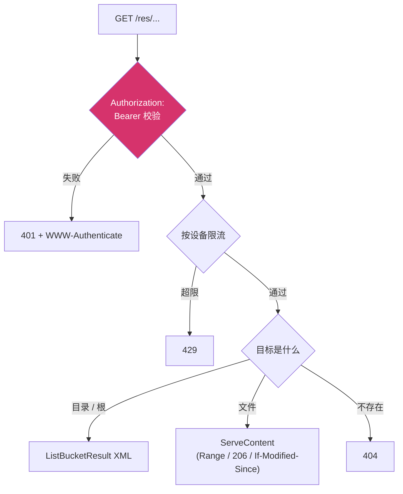

# 资产分发面

> **资深向**。涉及令牌校验、目录穿越防护、S3 清单分页,以及为什么每个决定都是那样。

`internal/api/resource` 是边缘节点对外提供资产的地方。客户端从
[`/client/init`](/protocol/client-server#asset-auth-取资产的钥匙) 拿到 `asset_auth`,
拿它当 Bearer 令牌直接来这里要清单与文件。

线上契约见[边缘 resource 节点分发面](/protocol/client-server#边缘-resource-节点分发面);
本页讲**实现为什么长这样**。

## 它替代了什么

::: warning 在此之前,资源目录是裸挂的
旧实现是一行 `http.FileServer` 挂在 `/res` 下。签发方老老实实签出 `resource_token`
下发给客户端,**却没有任何地方校验它**——谁探到路径谁就能把整棵资产树拉走。

这不是"鉴权做得不够严",是鉴权那一半根本没写。纪律文件 §3 要求的三件事(Bearer
鉴权、S3 清单端点、Range)一件都没落地,只是没人去核对过。
:::

顺带暴露的一个问题:签发侧与(不存在的)校验侧各写了一份 HMAC,单位一个用毫秒
一个用秒都没人发现——**因为当时根本没有校验方**。补上校验之后,两边的实现被合并
进 `internal/resourceauth`。

## 三条路径



### 为什么不用 `http.FileServer`

它会给目录生成一页 HTML 索引。那既不是客户端要的格式,又把整棵目录树的结构白送给
任何一个探到路径的人。所以这里显式区分:**目录 → XML 清单,文件 → 内容**。

### 中间件顺序:先验令牌,再限流

反过来的话,未鉴权的请求也会占用限流配额,任何人都能凭空把某个设备的额度耗光。

限流按**已验签令牌里的设备**计,而不是按 IP——同一出口 IP 后面可能是整个校园网,
按 IP 会让他们互相拖累;而设备是令牌签过的,伪造不了。默认每分钟 600 次:资产是
按需逐个取的,一个场景切换就可能几十个请求,阈值给宽些;它挡的是"拿一枚令牌把整棵
资产树拖走"这类行为,不是正常加载。

## 目录穿越:用 `os.Root`,不自己查 `..`

```go
r, err := os.OpenRoot(h.Dir)   // 之后所有 Open/Stat 都关在这个目录里
```

::: danger 手写检查挡不住符号链接
`strings.Contains(key, "..")` 这类检查挡得住 `../`,**挡不住指向资源根目录外的符号
链接**——而后者恰恰是这类漏洞最常见的形态。`os.Root` 在系统调用层面拒绝逃逸,
不依赖我们把每种写法都想全。

两种情形都有回归测试:`TestNoPathTraversal`(含 URL 编码变体)与
`TestNoSymlinkEscape`。
:::

## 取文件:交给 `ServeContent`

Range 解析是这类代码里最常见的出错点——多段范围、后缀范围(`bytes=-N`)、越界钳制,
每一条都能写错。`http.ServeContent` 已经处理了它们,连同 `If-Modified-Since`、
206 应答与 Content-Type 嗅探。没有理由重写。

## 清单:S3 `ListBucketResult` 的子集

### 刻意不发 `ETag`

S3 的 `ETag` 是文件 MD5。为了一次清单去读完整棵资产树算摘要,代价与收益完全不成
比例;但也**不能编一个**——客户端会拿它做完整性判断,给一个假值比不给危险得多。
需要校验时用单文件的 sha256 契约,不走这里。

### 截断如实上报

```go
if len(out.Contents) == maxKeys {
    out.IsTruncated = true
    out.NextMarker = out.Contents[len(out.Contents)-1].Key
    break
}
```

谎报 `IsTruncated: false` 会让客户端以为资产就这么多,少下的那些要到运行时才暴露
——那时候症状是"某个场景缺图",离原因很远。

`marker` 用**严格大于**(`o.Key <= marker` 跳过):用 `>=` 会把上一页最后一个 key
重复一遍,分页拼起来就多出一条。

### `max-keys` 有硬上限

默认 1000,硬上限 5000。放开到无穷的话,一次请求就能让服务端遍历整棵资产树并把结果
全部驻留内存——这是个不需要任何凭证之外条件的放大攻击。

## 令牌:`internal/resourceauth`

```
cnva1.<base64url(device_id)>.<时间桶>.<base64url(HMAC-SHA256)>
```

设计理由(线格式细节见[协议页](/protocol/client-server#令牌对客户端不透明)):

| 决定 | 为什么 |
|---|---|
| **自描述**(把 device 编进令牌) | 校验方不必让客户端额外送一个头,也不必连数据库。边缘节点只要有密钥就能独立完成校验 |
| **HMAC 而非 Ed25519** | 令牌的全部权限就是"读资产",而校验方本来就持有资产。它能自己签一个也不会多拿到任何东西——不存在会话令牌那种"校验方能凭空造出身份"的问题。对称方案省一次签名运算、省一套密钥分发,在每个文件请求都要验一次的路径上这是实打实的 |
| **MAC 覆盖含前缀的整个载荷** | 与 `internal/clienttoken` 同一条纪律:版本前缀签进去,将来出 `cnva2` 时不能把新载荷搬到旧前缀下复用签名 |
| **先验签再看时间** | 时间是令牌里的明文字段,没验签之前它只是攻击者写的数字 |
| **接受当前桶与上一个桶** | 只认当前桶的话,签发方与校验方之间哪怕几秒的时钟差,都会让恰好在桶边界签出的令牌当场失效;而这类失败在日志里看起来就是随机的、无法复现的 401 |
| **密钥 < 16 字节一律拒绝** | 短密钥的 HMAC 可以离线暴力破解,而症状是"一切正常" |

### 那份拷贝

::: danger `internal/resourceauth` 在 API 服务端有一份完全相同的副本
令牌在 API 服务端签发、在这里校验,两边必须**字节级一致**。两个仓库不共享 Go
module,做不到只留一份实现。

与其指望后来的人记得同步,不如让机器盯着:两边的 `token_test.go` 各钉了一枚
**跨仓库测试向量**(同一组 secret / device / 时刻必须算出同一个串)。谁单方面改了
算法、拼接顺序或编码,测试当场红——而不是等上线之后表现为"所有资产请求都 401",
那种故障从错误信息里完全看不出根因。

改这个包之前先读 `token.go` 顶部的包注释。
:::

## 挂载与配置

业务节点与边缘节点都挂这条路径(`mountAssets` / `mountAssetsWithSecret`):

| 变量 | 说明 |
|---|---|
| `CNV_PRIMARY_RES_DIR` | 资源根目录。空 = 本节点不提供资产分发 |
| `CNV_SECONDARY_RES_DIR` | 边缘节点专用,优先级更高 |
| `CNV_PRIMARY_RES_PATH` | 对外前缀,默认 `/res` |
| `CNV_RESOURCE_TOKEN_SECRET` | HMAC 根密钥,≥16 字节 |
| `CNV_RESOURCE_TOKEN_WINDOW_SEC` | 时间桶长度,默认 300 |

::: warning 边缘节点没有数据库
业务节点的密钥缺失时会在 `config` 表里自动生成一把;边缘节点不能。密钥只能来自
环境变量,配漏了的表现是每个请求都 401(fail-closed)——但那要等客户端来了才暴露,
所以节点启动时会先明确报一次错。

打不开资源目录时**不挂载路由**,而不是挂一个每次都 500 的路由。
:::

完整配置见[配置项 · 资产分发](/deploy/configuration)。
