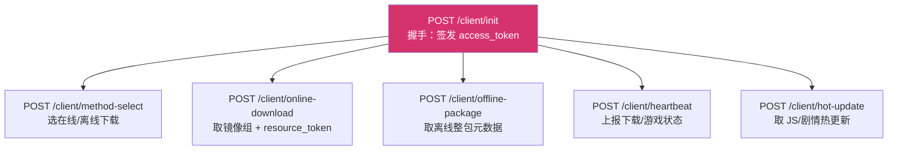
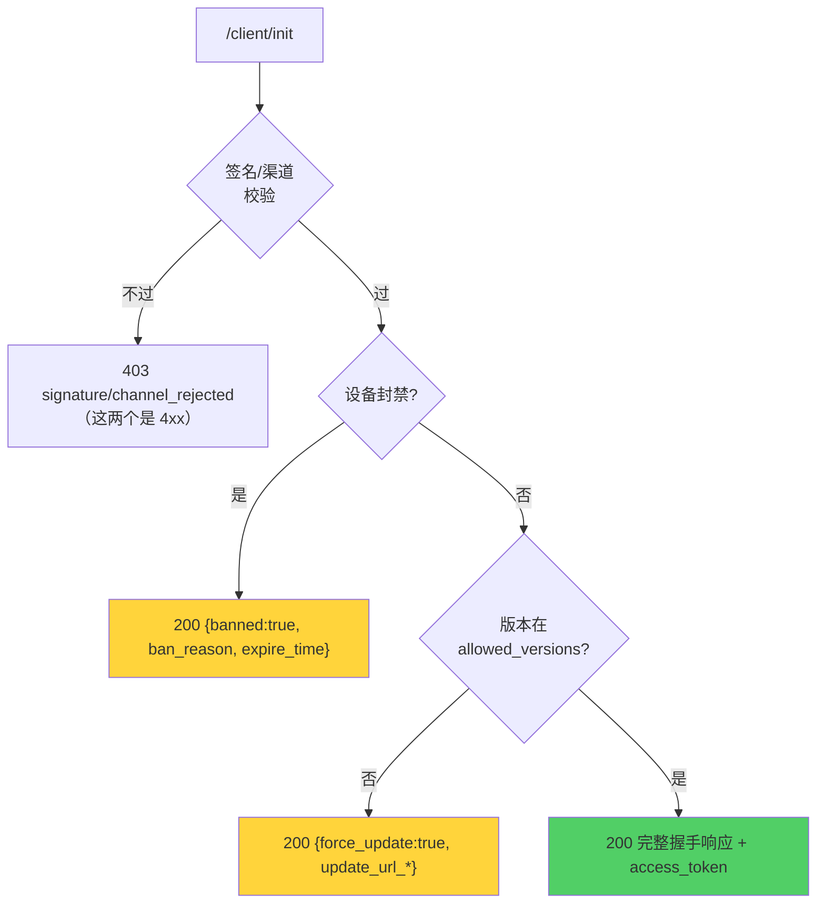

# 客户端 ↔ 服务端握手协议

`/client/*` 与 `/account/*` 是游戏客户端与复兴计划服务端之间的契约，共 6 + 4 个端点。

::: danger 唯一真理是已发布的 APK
客户端是**已签名、已分发**的 APK，字段名与解析逻辑钉死在包里，无法随服务端热改。
因此契约的仲裁者是客户端 Java 源码（`ClientInit.java` / `ResourceFlow.java` /
`SaveSyncHelper.java`），而不是服务端实现或本文档。

服务端侧的铁律：**只增不改**——JSON 字段只可新增，不可删除 / 改名 / 改类型 / 改语义；
新增字段必须可选。变更流程是「先加新字段 → 客户端适配发版 → 双跑过渡 → 再废旧」，
严禁让旧客户端在过渡期失效。
:::

| 这一侧 | 实现位置 |
|---|---|
| 客户端：请求构造与响应解析 | `patch/src/main/java/io/kamihama/cnv/ClientInit.java`，端点常量在 `CloudEndpoint.java` |
| 服务端：响应生成 | `internal/api/client/handlers.go` + `state.go` |
| 服务端：保真测试 | `internal/api/client/protocol_test.go`——任何改动都要让它继续通过 |

改这些响应前请先读 [协议保真原则](/contributing/server/protocol-fidelity)：一个字段名拼错、
一个 `null` 发错，真机就会崩或行为异常，而服务端测试如果没覆盖到就发现不了。

## 端点全景



除 `/client/init` 外，其余 5 个都要带**鉴权三件套**。

### 客户端的端点常量

`API_HOST` 在源码中为**空字符串**，由 CI 在编译前从 Secret `CNV_API_HOST` 注入；
所有端点都是 `API_HOST + 路径`。同理 `CAP_WORKER_URL` 由 `CNV_CAP_WORKER_URL` 注入，
`DIRECTORY_PUBKEY`（签名节点目录的 Ed25519 根公钥）由 Variable `CNV_DIRECTORY_PUBKEY` 注入。

| 常量 | 路径 |
|---|---|
| `CLIENT_INIT` | `/client/init` |
| `CLIENT_HEARTBEAT` | `/client/heartbeat` |
| —（method-select） | `/client/method-select` |
| —（online-download） | `/client/online-download` |
| —（offline-package） | `/client/offline-package` |
| —（hot-update） | `/client/hot-update` |
| `ACCOUNT_LOGIN` | `/account/login` |
| `ACCOUNT_REGISTER` / `ACCOUNT_FORGOT` | `/account/register` / `/account/forgot` |
| `ACCOUNT_SAVE_PUT` / `ACCOUNT_SAVE_GET` | `/account/save/put` / `/account/save/get` |

::: tip 为什么硬编码进 APK 而不放 assets？
这些 URL 被视为**客户端可信链的一部分**，与 APK 同寿命。刻意**不放进 `assets/`**
做运行时可改，以防 init API 被替换后整套客户端被劫持。
:::

::: warning `FALLBACK_GAME_SERVER_HOST` 是唯一**不能留空**的常量
它是离线模式直连 Totentanz 后端的兜底 host（纯 host，无协议无路径）。用在「服务端不可达」
这条路径上——那时候恰恰拿不到 `/client/init` 下发的 `services.game_server_host`，只能靠它。
留空 = 离线模式直接失效。

它**随底包走而不是随部署走**：底包换一次、Totentanz 后端域名换一次，这个值就要跟一次。
所以源码里保留可用默认值（当前对应 totentanz 1.2.0_r128 的 `totentanz-9b.magi-reco.com`），
只在默认值与当前底包不符时才用 Variable `CNV_GAME_SERVER_HOST` 覆盖。正常联网时它不生效。
:::

运行时并非固定打 `API_HOST`：握手成功拿到[签名节点目录](#签名节点目录)后，
登录/账号/存档/资源等请求会按节点声明的能力（`caps`）改路由；无目录或验签失败时一律回退
`API_HOST`。

## 鉴权三件套 authTriple

```json
{
  "device_id":    "<DeviceId.get 的 SHA-256 设备指纹>",
  "access_token": "<服务端签发的会话令牌>",
  "signature":    "<ClientSignature.get 的 APK 签名证书摘要>"
}
```

服务端校验链：token 合法 → 绑定该 `device_id` → **`signature` 与握手时一致** → 未封禁。
`signature` 中途变化会作废会话（疑似换包）。

三个字段在客户端如何生成详见[客户端安全机制](/security/client)；服务端如何校验详见
[会话与令牌](/security/sessions-tokens)。

## `/client/init` 握手

### 请求

```json
{
  "version":   "4.0.0",
  "device_id": "玩家设备唯一标识",
  "signature": "APK 签名证书 SHA-256（小写 hex）",
  "channel":   "normal"
}
```

| 字段 | 说明 |
|---|---|
| `version` | 客户端版本号，点分格式 |
| `device_id` | 设备指纹，贯穿封禁/会话/审计 |
| `signature` | **防改包核心**，与服务端白名单比对 |
| `channel` | `UpdateChannel.get`——用户所选渠道 `normal` / `internal-test`，未选时回退 `BuildChannel` 构建期默认。决定更新提示频率与下载哪个 APK |

字段缺失时服务端支持 `X-Device-Id` / `X-Client-Version` / `X-Signature` 头兜底
（便于老客户端与调试）。

握手本身**尚无会话令牌**，服务端凭 `device_id + signature` 验证合法性后在响应里签发
`access_token`。

### 响应字段

```json
{
  "success": true,
  "banned": false,
  "access_token": "32 字节 hex",
  "server":   { "status": "ok", "message": "", "end_time": 0 },
  "client":   {
    "allowed_versions": ["4.0.0"],
    "latest_version": "4.1.0",
    "update_url_normal": "https://.../v4.1.0.apk",
    "update_url_internal_test": "https://.../v4.1.0-test.apk",
    "update_apk_sha256": "<对应渠道 APK 的 sha256>"
  },
  "spoof":    { "fake_version": "1.0.0", "fake_name": "マギレコ" },
  "features": { "online_download": true, "offline_package": true },
  "services": { "cap_worker_url": "...", "game_server_host": "..." },
  "offline_pack": { "min_version": "20250501" }
}
```

| JSON 字段 | 含义 |
|---|---|
| `banned` / `ban_reason` | 封禁标志与原因 |
| `force_update` | 版本被服务端拒绝 |
| `access_token` | 会话令牌 |
| `server.status` / `.message` / `.end_time` | `normal`/`maintenance`/`error` + 维护文案 + 结束时间（Unix 秒） |
| `client.allowed_versions[]` | 允许的版本列表（空 = 不限制） |
| `client.update_url_normal` / `.update_url_internal_test` / `.update_apk_sha256` | 更新 APK 地址（按渠道）与指纹 |
| `client.latest_version` | **软更新提示**，见[三道更新闸门](#三道更新闸门) |
| `spoof.fake_version` / `.fake_name` | 向 native 伪造的版本 / 应用名，绕过日服客户端检测 |
| `features.online_download` / `.offline_package` / `.account_enabled` / `.disabled_message` | 功能开关（默认均 true）+ 关闭提示；`account_enabled=false` 时客户端跳过登录/存档/悬浮窗等全部账号逻辑 |
| `services.cap_worker_url` / `.game_server_host` / `.proxy_backends[]` | cap-worker 端点、游戏 host、代理后端列表 |
| `services.game_server_base` | **可选**。游戏 **API** 后端的完整 base URL（含路径）。仅来自运维配置——`game_server_host` 只能装纯 host、会把路径丢掉，故补此字段。native 层优先用本值，缺省回退 host 拼接 |
| `services.resource_base` | **可选**。上游 Totentanz 的**资源**基址（来自端点发现）。与 `game_server_base` **严格区分**，见[上游端点发现](#上游-totentanz-端点发现) |
| `services.game_max_threads` | **可选**。上游建议的 HTTP/2 并发数（实测会动态变化）；缺省或 ≤0 时客户端沿用自身默认 |
| `offline_pack.min_version`（或顶层 `required_pack_version`） | 要求的最低离线包版本 |
| `contributors[]` | 贡献者名单（`name`/`contribution`/`url`/`avatar_url`/`color`） |
| `directory.payload` / `directory.sig` | **可选**。[签名节点目录](#签名节点目录)；字段缺省 = 不下发，客户端按旧逻辑回退 `API_HOST` |

### 服务端：三类「不放行」分支



**为什么封禁 / 版本闸门是 HTTP 200 而非 4xx？**
客户端的 `Net.postJson` 在 HTTP ≥ 400 时会抛 `IOException`，拿不到 body。如果用 403
返回封禁，客户端就读不到 `ban_reason` 和 update URL。所以这两类「业务拒绝」用 200 +
顶层 flag 表达，只有签名 / 渠道这种「协议级拒绝」才用 4xx。

### 服务端：空值处理是省略而非 null

::: danger 绝不发送 JSON null
所有可选**字符串**字段未设置时**必须省略 key**。Android `org.json` 的 `optString` 对显式
`null` 会返回字符串 `"null"`，导致客户端拿到字面量 `"null"` 当成有效值。
:::

实现上用 `putIfNonEmpty`（字符串非空才写）和 `putIfNonZero`（整数非 0 才写）。
bool 字段不受此约束（`false` 是合法业务值）。

### `services` 同时是客户端 WebView 的信任锚

`services.game_server_host` 与 `services.proxy_backends[]` 除了给 native 层做端点重写，
还被客户端 `WebViewInterceptor` 当作 **WebView 来源闸的唯一受信任来源清单**。

客户端 1.2.0 起，WebView 的三项能力——本地文件供给（A 类汉化）、GET 缓存注入、
`CnvBridge` 注入——只对这两个字段所列 host 开放。原因：`addJavascriptInterface` 的作用域
是**整个 WebView 而非单个页面**，不设闸时该 WebView 一旦导航到任意第三方来源，那个页面
就能调 `CnvBridge.loadAllState()` 拖走玩家全部缓存状态。

::: danger 两者都不配 = 客户端汉化与存档回放静默失效
信任列表为空时客户端把**所有**来源判为不受信，B/C 类汉化与状态捕获/回放全部关闭，
而 HTTP 层一切正常、无任何报错——症状离原因很远。

服务端 `getServicesConfig` 会在两者皆空时打一条 `slog.Warn` 作为线索（只打一次）。
部署时务必至少配置其一。
:::

**形态约定**（客户端两种都能吃，但服务端保持现有归一化不要改）：

| 字段 | 服务端下发形态 |
|---|---|
| `game_server_host` | **纯 host**，无 scheme / 路径 / 尾斜杠（`normalizeGameServerHost` 归一化，兼容老配置里的完整 URL） |
| `game_server_base` | **完整 base URL，含路径**（`normalizeGameServerBase`：补协议、去尾斜杠、**保留路径**） |
| `proxy_backends[]` | **完整 URL**，含协议、不带尾斜杠 |
| `game_max_threads` | 整数；0 或缺省 = 不下发 |
| `resource_base` | 上游**资源**基址；与上面两个 API 字段严格区分 |

### 客户端：handleCloudInit() 处理顺序

最多重试 3 次，指数退避 `1000 << (attempt-1)`；3 次全失败 → `OfflineModeManager.activate()`
返回 false。成功后把 `access_token` 存 `cnv_account/session_token`，然后依次处理：

```
封禁 → force_update（弹应用内更新）→ maintenance/error
→ allowed_versions 版本闸门 → latestVersion 软更新提示 → Spoof.set
→ ProxyBackends.set/setGameServerHost → NodeDirectory.ingest（验签+激活目录）
→ 填充贡献者 → 写功能开关字段 → 两功能均关时按维护处理
```

握手开始前会先 `NodeDirectory.load()` 从持久化恢复目录与防回滚地板（重新验签）；
首个 `/client/init` 走 `API_HOST` 锚点、**不**参与路由。

## 三道更新闸门

`client` 对象里有三种「催更新」机制，优先级与行为各不同：

| 机制 | 字段 | 行为 | 优先级 |
|---|---|---|---|
| 强制更新 | `force_update:true` + `update_url_*` | 版本被拒，必须更新或退出 | 高（握手中先判） |
| 版本白名单 | `allowed_versions` | 当前版本不在列表 → 强制更新 | 高 |
| **软提示** | `latest_version` | 按渠道提示，可「暂不更新」 | 低（软） |

软提示按渠道有不同策略：

- **正式版（`normal`）**：仅当 `latest_version` 的 **major.minor** 高于当前才提示。
  补丁号变化（4.0.0→4.0.5）不打扰。
- **内测版（`internal-test`）**：任意版本位升高即提示（含补丁号）。

过滤完全在客户端做，服务端只需告诉它「最新版本号是多少」。
详见[版本闸门与软提示](/security/version-gates)与[启动引导](/client/bootstrap#更新渠道与软更新提示)。

## 签名节点目录

服务端可在 `/client/init` 响应里下发一份**用离线 Ed25519 私钥签名的节点表**。客户端用
钉死在 APK 里的根公钥（`CloudEndpoint.DIRECTORY_PUBKEY`）验签后，按每个节点声明的能力
`caps` 决定「哪类请求发给哪个节点」。客户端实现见 `NodeDirectory` + `Ed25519Verify`，
服务端实现见 `internal/directory/directory.go`。

::: tip 信任模型：钉公钥，不钉地址
地址是可变数据，信任建立在「离线私钥的签名」上。攻击者能返回任意字节，但没有私钥就签不出
合法目录 → 客户端拒绝。即便流量被导向某个只有 `resource` 能力的边缘节点，客户端也**不会**
把登录/账号/存档凭证发过去（该节点无对应能力）——凭证类请求被锁在被授权的业务节点上。
:::

### 线格式（JWS 风格透传 payload）

```jsonc
"directory": {
  "payload": "<base64url(UTF-8 紧凑JSON)，无 = 填充>",
  "sig":     "<standard_base64(Ed25519_sign(私钥, payload 字符串的 UTF-8 字节))>"
}
```

`payload` base64url 解码后的 JSON：

```jsonc
{
  "seq": 7,                  // int64，单调递增，防回滚
  "issued_at": 1735660800,   // 签发时间（Unix 秒，信息性）
  "expires_at": 1735833600,  // 过期时间（Unix 秒）；now > expires_at 即作废
  "nodes": [
    { "id": "biz-tokyo-01", "role": "business",
      "api": "https://api.magi-reco.top",
      "caps": ["init","login","account","save"], "region": "ap-northeast-1", "weight": 100 },
    { "id": "edge-hk-01", "role": "edge",
      "api": "https://cdn-hk.magi-reco.top", "caps": ["resource"], "weight": 80 }
  ]
}
```

::: warning 签名覆盖的是 payload 字符串本身
服务端对 **base64url 后的 `payload` 字符串的 UTF-8 字节**做 Ed25519 签名；客户端对**收到的
payload 字符串字节**直接验签，验过再 base64url 解码取 JSON。**无需重序列化**，彻底规避
跨语言紧凑序列化的字节对齐问题。

```go
inner, _ := json.Marshal(dir)
payload  := base64.RawURLEncoding.EncodeToString(inner)
sig      := ed25519.Sign(priv, []byte(payload))
```
:::

### 客户端校验顺序（`NodeDirectory.ingest`）

任一步失败即丢弃整份，保留旧缓存 / 回退内置地址：

1. **Ed25519 验签**（根公钥）——失败丢弃；
2. **防回滚** `seq ≥ 本地记住的最大值`——否则丢弃（合法签名的更高 seq 会抬高地板并持久化）；
3. **未过期** `now ≤ expires_at`——否则不激活，等待刷新；
4. 通过 → 替换内存目录并落盘（`cnv_node_directory`：`max_seq`/`payload`/`sig`），
   下次启动 `load()` 时重新验签恢复（防本地文件篡改）。

::: tip 未注入根公钥 = 安全回退
本地 / 未注入 `CNV_DIRECTORY_PUBKEY` 的构建**无法验证**目录 → 一律忽略目录、回退
`API_HOST`（而非「跳过校验直接信任」）。
:::

### 目录签名的标量必须规范（`S < L`）

客户端 `Ed25519Verify` 按 RFC 8032 §5.1.7 拒绝 `S >= L` 的签名，消除签名可延展性——否则
任何人无需私钥即可由一个合法签名构造出 `S' = S + L` 的另一个合法签名，而目录的
`(payload, sig)` 会被客户端落盘、下次启动重新验签。

Go 的 `crypto/ed25519` 本就只产出规范 `S`，服务端当前实现无需改动；`internal/directory`
已加回归测试 `TestDirectory_SignatureScalarIsCanonical` 钉住这条跨端契约，防止将来换签名
实现（自研 / HSM / 第三方库）时产出非规范签名而不自知——那会导致已发布客户端集体拒绝目录、
退回 `API_HOST`。

### 按 caps 路由

| 请求 | 路由到含此 cap、`weight` 最大的节点（无则回退 `API_HOST`） |
|---|---|
| `/client/init` 握手 | （锚点，固定 `API_HOST`，不路由） |
| `/client/method-select`·`online-download`·`offline-package`·`hot-update`·`heartbeat` | `init`（业务节点） |
| `/account/login` | `login` |
| `/account/save/get`·`/account/save/put` | `save` |
| 资源**文件**下载（镜像） | `resource`（边缘节点的 `api` 作镜像） |

**能力分配是安全关键**：业务节点 `caps` 为 `["init","login","account","save"]`，
边缘节点**仅** `["resource"]`。凭证类请求（login/account/save）绝不能指向只有
`resource` 能力的节点。

## 上游 Totentanz 端点发现

上游 Totentanz 不把后端地址写死在客户端里，而是提供一个引导端点换取地址：

```
POST https://<引导端点>/magica/api/snaa
Content-Type: application/json; charset=utf-8
{"version": 128}

→ {"message":"snaa","status":200,
   "response":{"endpoint":"https://xxx.example/en","max_threads":19,"version":128}}
```

原客户端由 `libuwasa` + `RestClient` 完成这件事，本项目已移除那一层，改由**服务端代劳**
（`internal/totentanz`）：后台周期拉取，结果经 `services` 下发。这样上游换后端时客户端一行
代码都不用改，地址变更也能在我们这一侧被观测到（日志里会打「Totentanz 上游端点/版本已变更」）。

::: danger 这个 `endpoint` 是**资源基址**，不是游戏 API 地址
逆向 libuwasa 可以确认它的用途只有资源：

- libuwasa **只 hook 了 `UrlConfig::resource`**（外加两个音频/连接数性能 hook），
  **没有** hook 任何 API 相关函数；
- 它内部的 endpoint type 共三个，全是资源路径：`/magica/resource`、
  `/download/asset/master`、`/resource/scenario`；
- 上游给的域名本身就叫 `ttz`**`strg`**（totentanz **storage**）。

因此发现结果只填 `services.resource_base`，**不碰** `game_server_host` / `game_server_base`
（那是游戏 API 语义，native 层拿它做 setURI 匹配与代理耗尽后的回退目标）。把资源 CDN 填进
API 字段，会让代理全挂时的 API 请求打到一台只服务静态文件的机器上。
:::

::: warning 游戏 API 的真实域名在 APK 里静态不存在
引擎 `UrlConfig::Impl::setUrl()` 只硬编码**路径**（`/magica/api/user/login`、
`/magica/api/system/native/getDomainPath`、`/chat/*` 等），`setServer(DomainType)` 与
`loadDefault()` **没有任何字符串引用**；`assets/` 与 `res/values` 里也没有。域名是纯运行时
获取的（`SelectURLGetResourceListState` 接受 `map<DomainType, vector<string>>` 那套多线路
选择）。

因此离线模式（服务端不可达）下**无法自主推断** API 地址，只能用与底包配套的
`FALLBACK_GAME_SERVER_HOST`。
:::

::: tip 上游不可控，这条链路只增强不削弱
- 拉取只在**后台**进行，绝不放在 `/client/init` 请求路径上——上游一慢，我们的握手不能跟着慢；
- 拉取失败**保留上次成功的结果**（stale-while-error），不清空；
- 从未成功过时完全沿用 KV 配置值，等于该功能未启用。

客户端侧的 `TotentanzDiscovery` 保留作查询资源基址之用，对上游**只读不信**：任何异常都
安静返回 `null`。上游挂掉最坏情况是「地址不再自动跟随」，不会让握手出任何问题。
:::

上游那套 API 本身的形状（205 个端点）见[上游游戏后端 API 清单](/protocol/upstream-api)。

## 其余端点

### `/client/online-download`

body = 鉴权三件套。响应：

```json
{
  "success": true,
  "resource_token": "HMAC 短时签名",
  "groups": [
    { "name": "线路A", "mirrors": [ {"url": "...", "files": [{"key":"...","size":1024}]} ] },
    { "name": "主节点本地", "mirrors": ["https://.../res"] },
    { "name": "副节点", "mirrors": [ {"url":"https://node-hk/", "files":[...]} ] }
  ]
}
```

- `resource_token`——S3/CDN 资源令牌，**与会话令牌独立**；
- 新格式 `groups[]`：每组 `name` + `mirrors[]`，mirror 可为字符串或 `{url, files[]}`，
  file 可为字符串或 `{key, size}`；
- 旧格式平铺 `mirrors[]` 字符串数组，客户端包装为单组「默认线路」；
- mirror 无内联 `files` 时，客户端 GET 该根 URL 期望得到标准 S3 `ListBucketResult` XML。

服务端三个来源按优先级拼接：管理后台镜像组 → 主节点本地 → 活跃副节点。

> **镜像限额过滤**：若某镜像当天流量超过管理员设定的日限额、或当前速度超过速度上限，
> 该镜像本次响应中**不出现**（客户端不感知，直接拿到过滤后的列表）。次日零点自动重置日流量。
> 对 CDN/S3 等不可控节点，仅控制调度（不派发），不限制已在下载的连接。

::: tip 就近下载改由签名目录下发
旧的「副节点心跳动态发现」组已下线，响应不再出现该动态组（结构与字段不变）。客户端改为把
[签名节点目录](#签名节点目录)里 `caps` 含 `resource` 的节点 `api` 合并为一条「就近节点（目录）」
下载线路（按 `weight` 降序），与管理后台镜像组并存供用户选择。
:::

### `/client/offline-package`

body = 鉴权三件套。

```json
{ "success": true, "download_url": "...", "package_version": "20250501", "sha256": "...", "size": 4096 }
```

::: warning 字段名是 `sha256` 不是 `md5`
部分历史注释里把校验字段写成 `md5`，但客户端解析代码读的是 `sha256`。以代码为准。
:::

### `/client/hot-update`

body = 鉴权三件套。

```json
{
  "success": true,
  "js":       { "version": 42, "sha256": "...", "download_url": "...", "size": 999 },
  "scenario": { "version": 23, "sha256": "...", "download_url": "...", "size": 888 }
}
```

`version` 为 int，`size` 客户端默认 -1。JS 与剧情两类热更新包，客户端比对本地版本决定是否拉取。

### `/client/method-select`

body = 鉴权三件套 + `method`（`online` / `offline`）。客户端忽略响应，仅用于上报玩家选择的
下载方式。

### `/client/heartbeat`

每 5 秒上报一次。body = 鉴权三件套 + `files` 数组（下载阶段）或空数组（游戏阶段）。
`files[]` 每项 `{ name, status: pending|downloading|done|failed, percent, speed_bps }`。

心跳只在**客户端自己下载**时携带逐文件进度，共三种来源：

| 来源 | `files` | 说明 |
|---|---|---|
| 在线资源下载 | 游戏资源多文件 | 客户端多线程下载，逐文件真实 `speed_bps` |
| 热更新 | 固定 `cn_js_update.zip` / `cn_scenario_update.zip` | 同上 |
| 游戏内 | 空 `[]` | 仅为收取封禁/维护指令，无下载进度与速度 |

> **离线整包不在心跳内**：离线包由系统浏览器下载、客户端只做文件导入，全程不发心跳，
> 因此不会出现在管理后台「心跳监控」，协议上也**不存在**「离线包下载速度」。

响应 `action`：

| action | 时机 | 含义 |
|---|---|---|
| `ok` | 常态 | 继续 |
| `maintenance` | 游戏阶段 + 服务器维护 | 顶层带 `message` / `end_time` |
| `switch_mirrors` | 下载阶段 + 管理员入队换线 | `assignments:[{mirror, files:[name]}]` |
| `ban` | 运行中被封 | 顶层 `reason` / `expire_time`，客户端会**本地持久化**封禁 |

管理后台 `/admin/heartbeats` 下发内存心跳表快照：`type` = `online`/`hotupdate`/`game`
（由 `phase` + 文件名推导），`progress`/`speed_bps`/`current_file` 由 `files[]` 聚合得到。

客户端侧的处理见[账号、存档与心跳](/client/account-save#心跳与实时封禁维护处理)。

## S3 列表解析

客户端 `S3List` 用纯正则解析 S3 `ListBucketResult` XML（不依赖 SAX/DOM）：`CONTENTS`
正则抓每个 `<Contents>` 块，块内 `KEY` / `SIZE` 正则取 `<Key>` / `<Size>`。`parse()` 返回
`List<Entry>`（key + size，size 解析失败为 -1），输入空 / 无块返回空 list，不抛异常。
在 `fetchManifestForGroup` 中用于镜像根 URL 的文件发现。

因此边缘 resource 节点必须提供 **S3 风格的 `ListBucketResult` XML 列表端点**，并支持
`Authorization: Bearer <resource_token>` 与 HTTP Range（客户端用单线程续传 + 多线程分片）。

## 字段真理的来源

| 客户端 Java 文件 | 对应服务端端点 |
|---|---|
| `ClientInit.java` | `/init`、`/online-download`、`/offline-package`、`/hot-update`、`authTriple()` |
| `ResourceFlow.java` | `/heartbeat`（ban / switch_mirrors） |
| `SaveSyncHelper.java` | `/account/save/{put,get}` |
