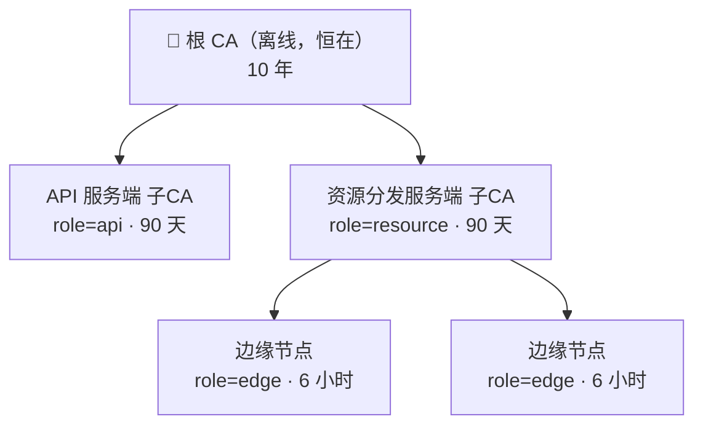

# 节点 PKI 与证书链

节点之间怎么互相证明身份、怎么隔离权限、出事了怎么立刻止损。

实现在 `internal/pki/`。

## 为什么不是一张公钥表

最早的做法是一张扁平表：**签发方标识 → 公钥**，每个校验方带外配置每一个签发方的公钥。

这个做法在节点数很少时能用，但资源分发服务端在设计上是**分布式**的——多个实例，每个下面再挂若干边缘节点。加一台机器就要去改所有校验方的配置，很快就没人维护得动。

证书链把这件事收敛成：**只钉一把根公钥**，其余身份靠链自证。

## 信任树



::: tip 根 CA 恒在
**无论是否连接 API 服务端，信任根都是同一个离线根。** 独立部署只是少了 `api` 这个参与者，而不是换一套信任模型。

早期方案是"连上 API 服务端时它就是根，独立时资源服务端自签根"。那样"谁是根"会随部署形态变化，是一整类「我现在处于哪个模式」的 bug 温床；而且它把「API 后端」和「信任根」两个身份混在一起——API 服务端一旦被击穿就等于根被击穿。

现在 `api` 与 `resource` 是**平级**子 CA，击穿其中一个也签不出另一个的身份。
:::

代价是：**根不能直签边缘节点**。独立部署也必须走 根 → 子 CA → 边缘 三级，不能图省事。这正是让两种部署形态链形状一致的原因。

## 两根正交的轴：角色与能力

它们回答的不是同一个问题，**不可混用**：

| | 回答什么 | 取值 |
|---|---|---|
| **角色** `role` | 你是哪一类节点 | `root` / `api` / `resource` / `edge` |
| **能力** `caps` | 能对客户端做什么 | `init` / `login` / `account` / `save` / `resource` |

谁能签出谁，由角色决定：

| 签发方角色 | 可签出 |
|---|---|
| `root` | `api`、`resource` |
| `resource` | `edge` |
| `api`、`edge` | —（不能签发任何角色） |

::: danger 少了角色表，能力子集规则拦不住跨角色签发
根的 `caps` 是全集，所以一张 `api` 子 CA 证书只要 `caps` 不越界，就能签出一个 `role=resource` 的证书——**冒充一台资源分发服务端**。

角色表堵死了这条路：`api` 不在 `allowedChildRoles` 里对应任何角色，一张也签不出。签发侧与校验侧各拦一次。
:::

## 校验时逐条守住的不变量

一条链要通过校验，**每一级**都必须满足：

| 检查 | 漏掉会怎样 |
|---|---|
| 签名验得过 | — |
| `iss` == 上级 `sub` | 由 A 签发却把 `iss` 写成 B 的证书能混过去，后续按 `iss` 做的判断全部错位 |
| **签发者是 CA** | 任何持叶子证书的人都能给自己签下级，冒充任意主体。**这是证书链最经典的漏洞** |
| `path_len` 严格递减 | 链深度可无限延展 |
| **能力 ⊆ 上级能力** | 只有 `resource` 的边缘节点能给下级签出 `login`/`account`/`save`，能力隔离**无声失效** |
| 角色可被上级签出 | 见上一节 |
| 在有效期内 | 过期证书继续可用 |
| 未被吊销 | 紧急止损失效 |

::: warning 钉的是整张根证书，不只是根公钥
只钉公钥的话，链尾那张由根**直签**的证书没有上级可比对，上面的 CA / `path_len` / 能力子集三项检查会整个跳过——一张 `path_len` 写成 9、能力写成全集的子 CA 可以直接通过，**而且毫无症状**。

钉整张证书之后，根作为普通上级参与同一套检查，没有特例。
:::

## 三层有效期

| 层 | 默认 | 为什么 |
|---|---|---|
| 根 | **10 年** | 离线。轮换靠多锚重叠期而不是靠过期——让根频繁过期只会逼着人把根私钥反复拿出来用，反而削弱"离线"本身 |
| 子 CA | **90 天** | 手工签发的那一层，人能承受的频率上限大概在这里 |
| 边缘叶子 | **6 小时** | 变动频繁；更重要的是**这一层的吊销问题被有效期消掉了** |

::: tip 小时级叶子让边缘层不需要吊销列表
机器下线后最多几小时证书自行失效，不需要吊销列表、不需要谁去拉，也就没有「拉不到吊销列表时 fail-open 还是 fail-closed」那个两难。

小时级只有在**自动续期**的前提下成立，而这不破坏"根离线"：续签边缘叶子的是资源分发服务端子 CA，它本来就在线；离线的根只参与 90 天一次的子 CA 签发。
:::

有效期不得低于时钟容差的 **20 倍**（默认容差 60s → 下限 20 分钟）。容差是为分布式时钟差存在的，它把有效窗口两端各撑开一点；有效期短到同量级时，这个"撑开"会吃掉可观比例的生命周期，续期节奏也跟着失真。

**续期时点定在生命周期过半**，不是临到期前——续期要走网络，过半意味着一次失败后还有半个生命周期可以反复重试。

## 双向鉴权

API 服务端与资源分发服务端建立连接时**双向**验证：各自出示证书链，并证明持有对应私钥。

::: danger 证书链是公开的，出示它证明不了任何事
链本来就要发给对端看，任何抓到过一次握手的人都能原样重放。所以必须有**持有性证明**：验证方给随机挑战，对端用私钥签它。

而且不能只签随机数——那样有**反射攻击**：攻击者拿 A 给它的挑战转手去问 B 要签名，再交回 A 冒充 B，甚至能把挑战反射给 A 自己。被签名的消息里绑了「谁在证明、向谁证明」，一份签名只在它被制造出来的那个方向上有效。
:::

挑战最短 16 字节，签名侧与校验侧都拒绝更短的。

## 客户端能验服务端吗

**能，而且比想象的便宜——但在纯网页端不成立。**

先拆开两件常被混为一谈的事：

| 方向 | 客户端需要什么 | 成本 |
|---|---|---|
| 客户端验服务端 | 只要**钉住根公钥**。验签是公钥操作，无私钥、无签发、无注册 | 近乎零 |
| 服务端验客户端 | 客户端要有自己的密钥对 + 被签发 + 注册流程 | 高，价值可疑 |

防 DNS 劫持只需要第一行。攻击者能做到的极限是原样重放他抓到的真链（链本来就公开），但他签不出客户端**这次新生成**的挑战；他也可以自建一整套同名 CA 并正经应答挑战——整条链自洽，唯一对不上的是**根公钥**。

::: warning 纯网页端上，这个保证不成立
钉住的根公钥是随 JS 一起从你的域名下发的。能劫持 DNS 的攻击者同时也能拿到该域名的 DV 证书（域名验证恰恰只验 DNS），于是他能合法地用 HTTPS 送出**他自己的 JS，里面钉着他自己的根**——验证逻辑本身就是他给的。

**信任锚从你要保护的那条信道上下发，就起不到保护作用。**

iOS 上 PWA 能装、能跑 Service Worker，但缓存会被存储回收清掉，且 Web 内容没有代码签名边界，不构成安全边界，这个循环没被打破。打包客户端（桌面端）才打得破，因为锚点烧在二进制里。

**所以当前网页客户端侧走 TLS + HSTS(preload) + CAA 记录。** CAA 是其中唯一对 DV 劫持有实际效果的一环——它限制哪几家 CA 可以给你的域名签证书。

服务端之间的互鉴不受影响，它们不经过浏览器。将来若出桌面端，客户端验证这条直接接上。
:::

## 根轮换

**信任根可以同时钉多把**，这是轮换的前提：

```
① 新根加入所有节点的 CNV_PKI_ANCHORS（此时新旧并存）
② 用新根重签所有子 CA
③ 老根到期后从 CNV_PKI_ANCHORS 移除
```

::: warning 只钉一把根 = 换根就得重新分发所有客户端
这类设计最常见的死法就是当初只钉了一把。信任根按**公钥**去重、按主体建候选索引，所以新旧两把**同名**的根可以并存；只按名字索引的话，新根加进来会把老根静默挤掉，老根签的所有子 CA 当场全废，报的还是"签名校验失败"这种完全指错方向的错。
:::

## 紧急吊销

小时级有效期让正常下线不需要吊销，但**紧急情况下"最多几小时"不够快**——机器被入侵、私钥疑似泄漏、运维误签，这些要的是"立刻"。

::: tip 这里可以推，不必拉
传统吊销列表的麻烦在于校验方要主动拉，拉不到时 fail-open 还是 fail-closed 两难。

这套架构里校验方（各节点）本来就挂在管控通道上，上级**直接推**，延迟是一次 WS 往返；推不到的节点在管控通道上是**可见的离线状态**，不存在"以为拉到了其实没拉到"的静默失败。
:::

每条吊销记 `(序列号, 原过期时刻)`，过了就删——那之后证书自己已经失效，条目没有意义。所以吊销集大小由「有效期内被吊销的证书数」决定，**不随时间无界增长**，传统 CRL 最麻烦的运维问题在这里自然消失。

**吊销一张子 CA，它签出的整棵子树随之失效。**

操作步骤见 [运维手册 · 紧急踢出一台节点](/deploy/operations#紧急踢出一台节点)。

## 线格式

三类对象各用各的版本前缀，互相不会混淆：

| 对象 | 前缀 | 结构 |
|---|---|---|
| 证书 | `cnvc1.` | `cnvc1.<base64url(紧凑JSON)>.<base64url(Ed25519签名)>` |
| 证书签名请求 | `cnvr1.` | 同上，签名是申请者自签 |
| 持有性证明 | `cnvp1.` | 域分隔前缀 + 挑战 + 证明方 + 验证方 |

证书链是 JSON 数组，**叶子在前、越往后越靠近根，不含根证书本身**（根由校验方钉住，不能由对端提供——否则等于让攻击者自带信任根）。

**签名覆盖 `cnvc1.<payload>` 的 ASCII 字节**，把版本前缀也纳入签名。这与[签名节点目录](/server/multi-node)不同（那边只签 payload）：目录的版本在 payload 内部，而本证书的版本在前缀上；不签进去的话，将来出 `cnvc2` 时可以把新载荷搬到旧前缀下复用签名。

## 相关

- 操作步骤（建根、签发、续期、紧急踢出）→ [运维手册](/deploy/operations)
- 配置项 `CNV_PKI_*` → [配置参考](/deploy/configuration)
- 会话令牌（与节点证书是两套东西）→ [会话与令牌](/security/sessions-tokens)
