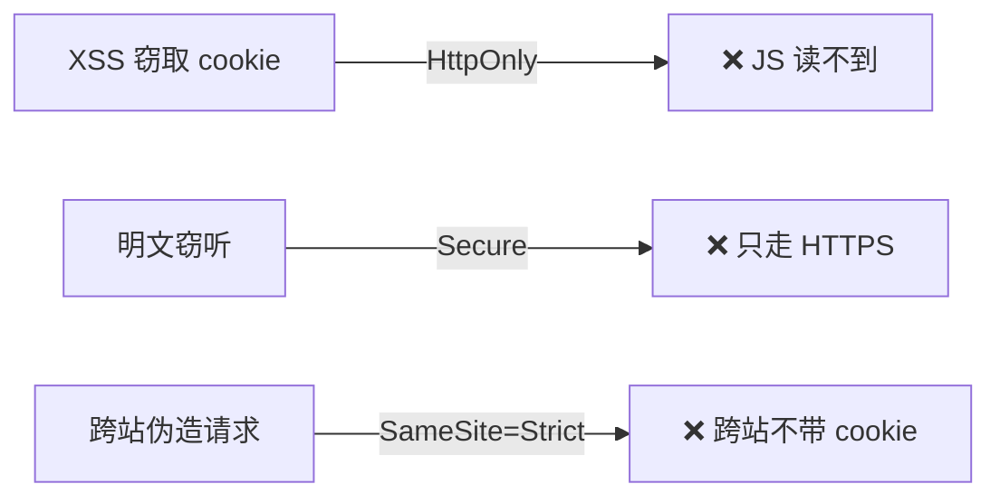
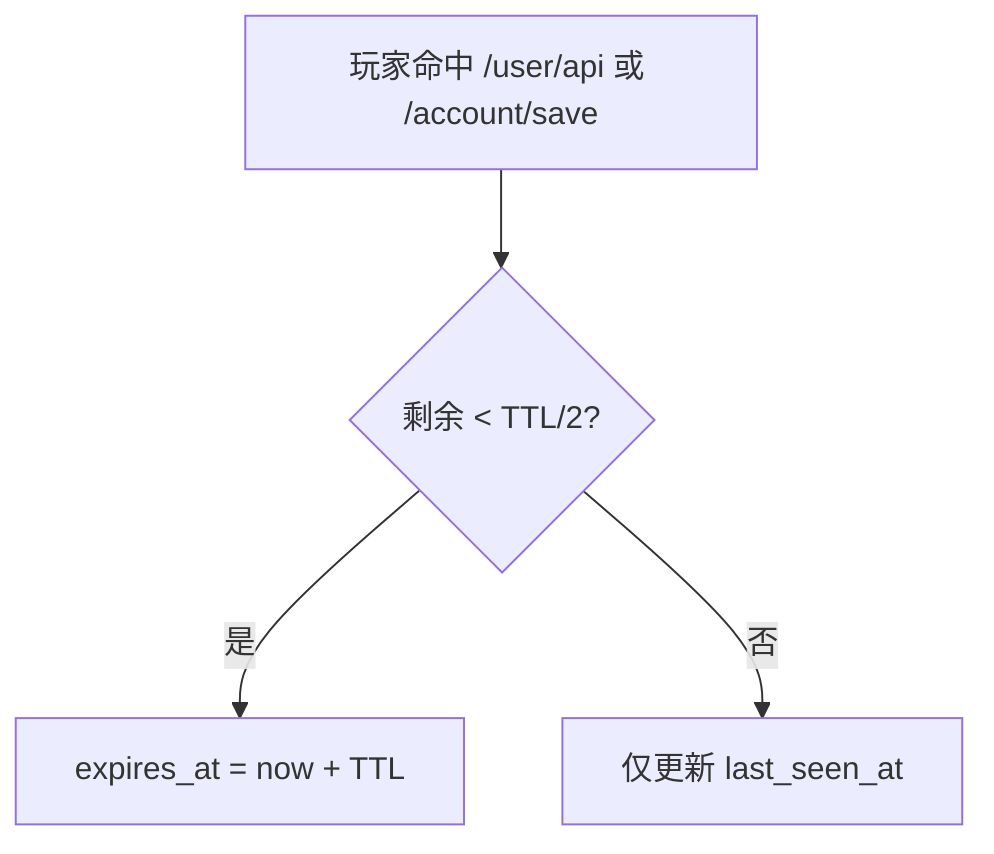
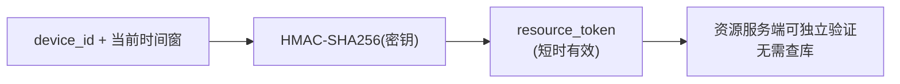
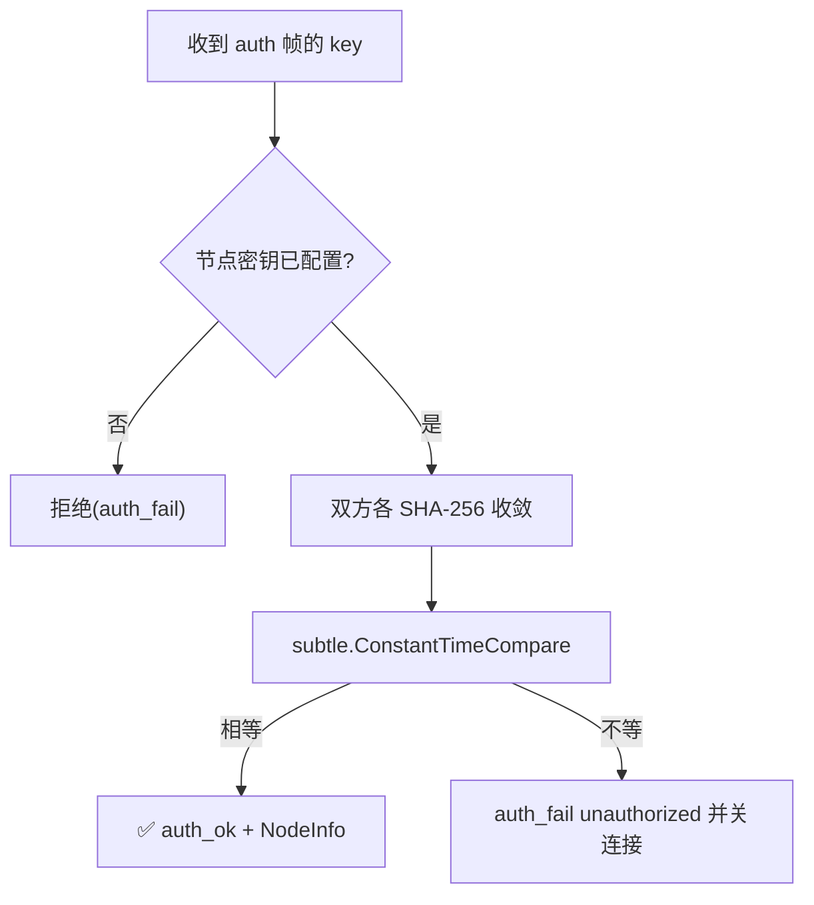

# 会话与令牌

各类令牌如何生成、存储、校验、失效。三套会话的整体设计见 [架构 · 三套会话体系](/server/sessions),本页聚焦**安全属性**。

::: warning 客户端 access_token 已改为自包含签名令牌
下面「令牌生成」一节描述的随机 hex + 查库模型,现在只适用于**管理员会话、玩家会话、邮箱验证码**这几类。

客户端握手签发的 `access_token` 走另一套,见[下一节](#客户端-access-token-自包含签名)。旧的 64 位 hex 客户端令牌**已一律拒绝,没有降级分支**。
:::

## 客户端 access_token:自包含签名

`/client/init` 签发的令牌形如:

```
cnv1.<base64url(紧凑JSON)>.<base64url(Ed25519签名)>
```

载荷里带 `device_id`、客户端签名、版本、渠道、账号 UUID、签发/过期时刻与 `jti`。

### 为什么不再查库

旧模型下校验 = 拿令牌去 `client_sessions` 查一行,这意味着**签发方与校验方必须共用同一个数据库**,账号系统因此被钉死在资源分发服务端里。

而账号在架构上属于 API 服务端,资源分发服务端应该只持有它下发的身份。要拆开两者,令牌就必须能被**没有账号库的一方**独立验证。

用 Ed25519 而不是 HMAC:共享密钥意味着校验方也能签发,那就没有"谁是身份源头"可言了。非对称签名下校验方只拿公钥,伪造不出签发方的令牌。

### 撤销没有让步

自包含令牌的通病是"签出去收不回"。这里的处理是按签发方分流:

- **本节点签发的令牌**仍要求 `client_sessions` 有对应行(主键存 `jti` 而非令牌本身)。后台"踢下线"删行**即刻生效**,与从前完全一致。
- **联邦模式下 API 服务端签发的令牌**本地根本没有它的行,那时"查不到"必须视为**有效**——否则一开启联邦就会把所有远端令牌全拒掉。

### 分流不留降级通道

前缀像新格式就只走验签,失败直接拒,**不会退回旧的查库路径**——那等于给伪造令牌开了一条降级通道。

::: tip 与节点证书是两套东西
会话令牌证明的是"这个客户端设备是谁",[节点证书](/security/node-pki)证明的是"这台机器是信任树里的哪个主体"。两者都用 Ed25519,但密钥、格式、生命周期、撤销方式都不同,不要混淆。
:::

## 令牌生成（管理员 / 玩家 / 验证码）

以下几类会话 token 来自同一个生成器:

```go
func NewToken() (string, error) {
    b := make([]byte, 32)
    rand.Read(b)               // crypto/rand,密码学随机
    return hex.EncodeToString(b), nil   // 64 字符 hex
}
```

- **32 字节 = 256 位**密码学随机,空间足够大,无法枚举/预测。
- 用 `crypto/rand`(非 `math/rand`),不可被种子推断。
- 校验先过 `IsWellFormedToken`(长度 64 + 仅 `[0-9a-f]`),格式不对直接拒,省一次查库。

## 安全 Cookie 属性

网页端(玩家 / 管理员)用 `mr_session` cookie 承载 token:

```go
http.SetCookie(w, &http.Cookie{
    Name:     "mr_session",
    Value:    token,
    Path:     "/",
    HttpOnly: true,                     // JS 读不到 → 防 XSS 窃取
    Secure:   r.TLS != nil,             // 仅 HTTPS 传输 → 防明文窃听
    SameSite: http.SameSiteStrictMode,  // 跨站不带 → 防 CSRF
    MaxAge:   int(ttl.Seconds()),
})
```



::: warning Secure 依赖 HTTPS
`Secure: r.TLS != nil` —— 只有 TLS 终结于本进程时才置 `Secure`。如果你在前置网关终结 TLS,本进程看到的是 HTTP,`Secure` 不会被置上。这种部署下务必确保**外部入口是 HTTPS**,且 cookie 仅经 HTTPS 下发。
:::

## 会话有效期与失效

| 会话 | TTL | 失效途径 |
|---|---|---|
| client_session | 7 天 | 过期、signature 中途变化、设备封禁 |
| account_session | 30 天(滑动) | 过期、改密(其它设备)、找回密码(全部)、停用 |
| admin_session | 7 天 | 过期、登出、找回密码 |

过期会话由调度器"会话 GC"任务定期清理(默认 300s)。

### 滑动续期(仅玩家会话)



"记住登录"的实现。安全权衡:被盗 token 持续使用也会自动续命,所以 TTL 不设过长(30 天)。需要时可强制下线(改密/找回)。

## 资源 token:无状态短时签名

`/client/online-download` 返回的 `resource_token` 不走数据库,而是 **HMAC 短时签名**:

```go
bucket := now / windowSec          // 时间窗编号
mac := hmac.New(sha256.New, s3Secret)
mac.Write(deviceID + "|" + bucket)
token := base64.RawURLEncoding(mac.Sum(nil))
```



- 绑定 `device_id` + **时间窗**(默认 30 秒一个窗),过窗即失效。
- 用 HMAC,**服务端可独立验证**,无需存储 —— 资源节点拿密钥就能验,天然适配多节点。
- 签名根密钥(`CNV_RESOURCE_TOKEN_SECRET`,不设则首次启动自动生成 32 字节并持久化)可在后台轮换。

## 节点连接密钥(管控通道)

面板↔节点的管控 WebSocket 握手用节点自持的连接密钥鉴权(节点首次启动生成 32 字节随机密钥、管理员复制到面板注册表)。密钥比较走**等时常量比较**:

```go
func SafeStrEq(a, b string) bool {
    ha := sha256.Sum256([]byte(a))    // 先收敛成定长 32 字节
    hb := sha256.Sum256([]byte(b))    // (避免长度本身泄露信息)
    return subtle.ConstantTimeCompare(ha[:], hb[:]) == 1
}
```



为什么先 SHA-256 再比较:即便 `ConstantTimeCompare` 本身等时,直接比较不等长字符串仍可能因长度差异泄露信息;先各自哈希成定长,彻底消除长度侧信道。密钥是 64 位十六进制(32 字节随机),不存在弱口令问题。客户端的多节点发现则另用 Ed25519 签名目录,见 [多节点协调](/server/multi-node)。

## 令牌泄露的影响面

| 泄露的 token | 攻击者能做什么 | 缓解 |
|---|---|---|
| client access_token | 冒充该设备调 `/client/*` | 自包含签名（伪造需要私钥）+ device_id 绑定 + signature 一致性校验 + 7 天过期 + 封禁 |
| account_token | 冒充玩家读写云存档 | 安全 cookie + 改密下线 + 30 天上限 |
| admin_token | 管理后台操作 | 安全 cookie + 7 天短 TTL + 审计留痕 |
| resource_token | 短时下载资源 | 30 秒时间窗,过期即废 |
| 节点连接密钥 | 冒充面板向节点发管控指令 | 等时比较 + 32 字节随机 + 管控端口内网隔离 |

设计上**最敏感的 admin 会话 TTL 最短、不续期**;最需要"记住登录"的玩家会话 TTL 长但可强制下线;资源 token 干脆做成几十秒就失效的无状态签名。
