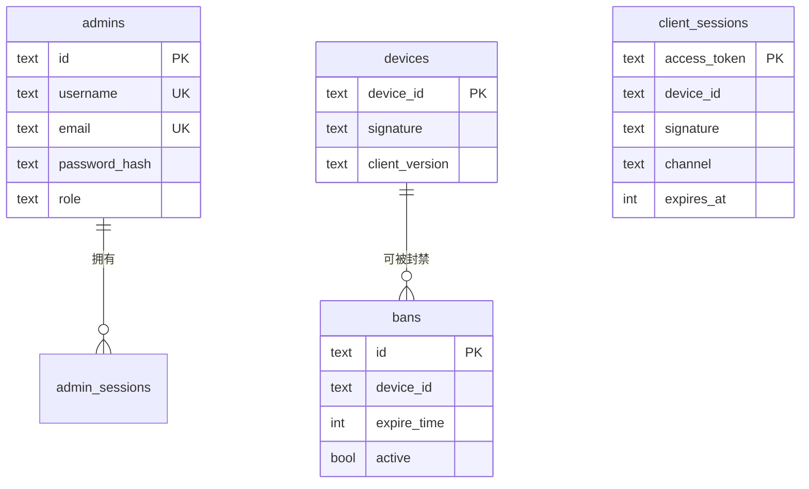

# 数据模型

主节点用一个关系数据库持有全部状态。本页是全表清单与关系总览。建表 SQL 内嵌在 `internal/store`,启动时按方言自动迁移。

::: warning 账号相关的表已整体移交 API 服务端
`accounts`、`account_sessions`、`saves`、`email_codes` 四张表**已从本服务端移除**。
账号系统在架构上属于 API 后端,资源分发服务端只持有它下发的身份——留一份在这边意味着
两套账号数据各自演化、迟早对不上。

同时移除的还有已废弃的 `secondary_nodes`(旧心跳式副节点发现遗留,新架构改用面板注册表
+ [签名节点目录](/server/multi-node))。

本页描述的是**现状**,共 13 张表。
:::

## ER 总览

## 全表清单

按职责分组。`config` 是一张 KV 表,承载大量运行配置(下文单列)。

### 身份

| 表 | 主键 | 关键字段 | 说明 |
|---|---|---|---|
| `admins` | `id` | `username`/`email`(唯一)、`password_hash`、`role` | 后台管理员。role: super_admin/admin/readonly |

### 会话(三套)

| 表 | 主键 | 绑定 | TTL |
|---|---|---|---|
| `admin_sessions` | `token` | `admin_id`(级联删) | 7 天 |
| `client_sessions` | `access_token` | `device_id` + `signature` + `channel` | 7 天 |

`client_sessions` **不绑账号**——握手在登录之前,而登录已经不在本服务端了。它现在存的是自包含签名令牌的 `jti` 而非令牌本身,详见[会话与令牌](/security/sessions-tokens#客户端-access-token-自包含签名)。

### 设备与封禁

| 表 | 主键 | 关键字段 | 说明 |
|---|---|---|---|
| `devices` | `device_id` | `signature`、`client_version`、`first_seen`/`last_seen` | 设备指纹,握手时 upsert(保留旧非空值) |
| `bans` | `id` | `device_id`、`expire_time`(NULL=永久)、`active`、`auto` | 封禁记录,按 device_id 查活跃封禁 |

### 玩家数据

| 表 | 主键 | 关键字段 | 说明 |
|---|---|---|---|

### 验证

| 表 | 主键 | 关键字段 | 说明 |
|---|---|---|---|
| `cap_challenges` | `token` | `c`/`d`/`s`、`expires_at`、`solved` | PoW 挑战 |
| `cap_tokens` | `token` | `expires_at`、`used` | 验证码兑换后的一次性令牌 |

### 配置

| 表 | 主键 | 说明 |
|---|---|---|
| `config` | `key` | KV 配置表(JSON 值),见下文 |

::: warning 五张资源表已删除(2026-08,迁移 `0005`)
`mirror_groups`、`mirrors`、`hot_bundles`、`offline_package`、`mirror_traffic`
随 APK 整包分发面一并删除。资产分发改由[资产分发面](/contributing/server/resource-plane)
承担,它直接读文件系统,不需要在数据库里维护一份镜像清单。

**这一步不可逆**:表里存的是管理员配置的镜像地址与日限额,`DROP` 之后就没了。
已经没有任何代码读它们,但想留底的话要在升级前自行导出。迁移用
`DROP TABLE IF EXISTS`,重复执行安全。
:::

### 运维

| 表 | 主键 | 说明 |
|---|---|---|
| `audit_log` | `id` | 审计日志,`ts`、`actor`、`type`、`target`、`details`(JSON)。按 ts/type/actor 建索引 |

## `config` KV 表

很多运行配置不单独建表,而是以 JSON 存进 `config`。键即配置域:

| key | 内容 | 谁读 |
|---|---|---|
| `server` | 服务器状态、维护文案、预计恢复时间 | `/client/init` 的 `server` 对象 |
| `versions` | 版本白名单、更新 URL、latest_version、伪装字段、APK 哈希 | `/client/init` 的 `client`/`spoof` |
| `features` | 在线/离线下载开关、停用文案 | `/client/init` 的 `features` |
| `services` | 验证码 URL、代理后端、游戏服 host | `/client/init` 的 `services` |
| `offline_pack` | 离线包最低版本门槛 | `/client/init` 的 `offline_pack` |
| `captcha` | PoW 开关与难度 | 验证码服务 |
| `tasks` | 各定时任务周期 | 调度器 |
| `auto_package` | 离线包自动打包策略 | 调度器 |
| `resource_token_secret` | 自动生成的 HMAC 密钥(hex) | 资产令牌(`asset_auth`)签名;边缘节点不读库,须用同值的 env 配 |

`config` 用 `ConfigGet`/`ConfigSet`/`ConfigEnsure` 读写,值是任意 JSON,结构由各业务的 Go struct 定义。这让"新增一个配置项"只需加 struct 字段,不用改 schema。

## 时间戳约定

- 数据库内统一存 **Unix 毫秒**(`BIGINT`/`INTEGER`),`nowMs()` 生成。
- 下发给客户端时,部分字段转成 **Unix 秒**(如 `server.end_time`、封禁 `expire_time`)—— 因为客户端 Java 那边按秒解析。换算在 handler 层做。

这个"库存毫秒、协议出秒"的边界很容易踩错,改相关字段时留意。

## JSON 列的方言差异

`config.value`、`audit_log.details` 等是 JSON:

| 数据库 | 列类型 |
|---|---|
| PostgreSQL | `JSONB` |
| MySQL | `JSON` |
| SQLite | `TEXT` |

Go 侧统一用 `json.RawMessage` 读写,不依赖数据库的 JSON 函数(只把它当文本存),所以三方言行为一致。

## 级联与清理

- 删 `admins` → 级联删其 `admin_sessions`(外键 `ON DELETE CASCADE`)。
- 过期会话与过期封禁由**调度器**定期清理,不靠外键。

完整的存储层设计(方言抽象、UPSERT 生成、迁移机制)见 [存储层与多方言抽象](/contributing/server/store-dialects)。
